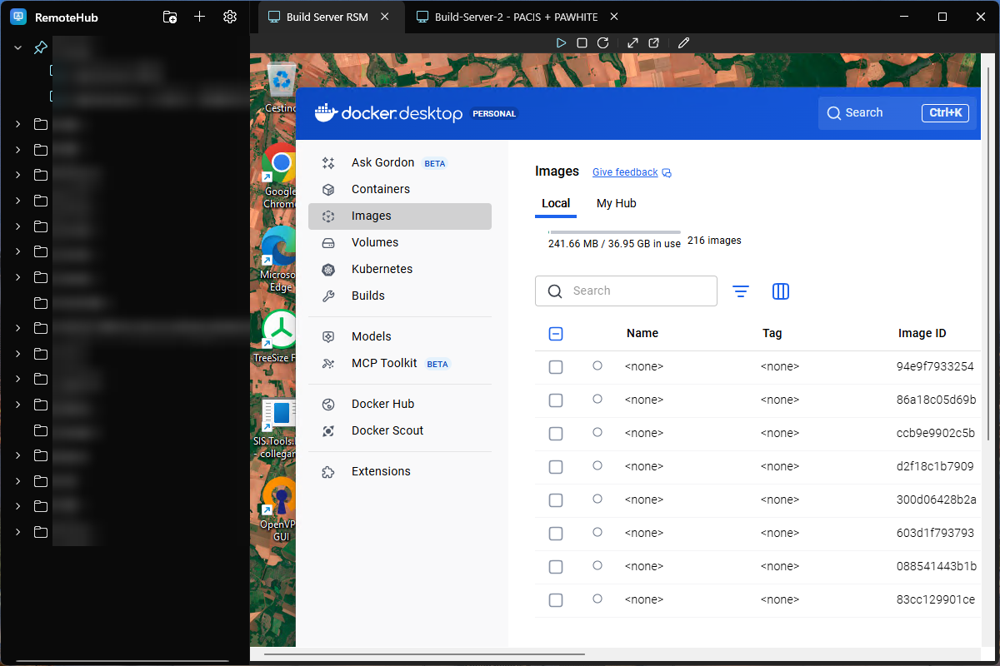
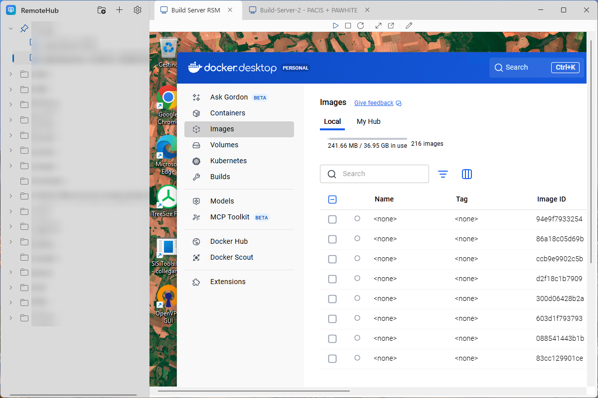

# RemoteHub

**All your RDP servers in one window, as tabs.** A free, open-source Remote Desktop manager for
Windows — no account, no telemetry, no license nag.



*(connection names blurred — that's a real tree)*

## Why

If you administer more than a handful of machines, plain `mstsc` means a taskbar full of identical
windows and a folder full of `.rdp` files. The commercial managers solve that, but they're heavy,
and the good parts are paywalled.

RemoteHub is the small version of that idea: a folder tree on the left, your sessions as tabs on the
right, and nothing else in the way.

## What you get

- **Everything in tabs.** Open as many servers as you like. **Switching tabs doesn't drop the
  session** — each one keeps running in the background, exactly where you left it.
- **A real connection tree.** Nested folders, pinned favourites at the top. Double-click (or select
  and press Enter) to connect.
- **Pop out any session** into its own window when you want it on a second monitor.
- **It's the real thing.** Sessions run on the same Windows RDP engine `mstsc` uses, so they look
  and behave exactly as you'd expect — clipboard and audio redirection included.
- **Import your existing setup** from a Devolutions RDM export in one step.
- **Passwords stay encrypted** behind a master password (AES-256-GCM). Optional — leave it off and
  Windows prompts at connect time as usual.
- **Updates itself.** New version shows a banner, one click, done.
- **Free and MIT-licensed.** Your connections live in a plain JSON file you own — point it at
  OneDrive or a share and it follows you between machines.
- **Light or dark**, following your Windows theme:



## Install

1. Grab the latest **`RemoteHub-*-Setup.exe`** from the
   [**Releases page**](https://github.com/adospace/remote-hub/releases).
2. Run it. That's the whole install — it's self-contained, so there's no .NET runtime to chase
   first.

Windows 10/11, 64-bit.

> **You'll hit a SmartScreen warning the first time.** *"Windows protected your PC"* /
> *"Unknown publisher"* → **More info** → **Run anyway**. The installer isn't code-signed, because a
> signing certificate costs more per year than this project has ever cost anyone. It isn't a sign
> anything's wrong — but don't take my word for it: the source is right here, and you can build it
> yourself in two commands (below).

## Coming from Remote Desktop Manager?

**Settings → Import from RDM…**, point it at an RDM XML export, done. Your folder structure comes
across as-is.

**Passwords are deliberately not imported.** RemoteHub refuses to read the credential fields in an
RDM export at all — you'll re-enter passwords for the connections you want saved. That's the
tradeoff for not shipping an importer that quietly hoovers up your entire credential store.

Export formats drift between RDM versions. If yours doesn't come across cleanly, open an issue with
a sanitised sample — that's the fastest way to get it fixed.

## About saved passwords

Saving a password per connection is **optional**. Skip it and the RDP prompt asks at connect time,
with username and domain pre-filled.

If you do save them, set a master password in **Settings**. Passwords are encrypted with
**AES-256-GCM**, the key derived via **PBKDF2-SHA256** (600k iterations). Only the encrypted blob is
written to disk; the master password itself is never stored. You're asked for it once at startup.

> **Forget the master password and the saved passwords are gone for good.** That's the design — no
> backdoor, no recovery. Your connections (host, port, username) are untouched; only the saved
> passwords are lost.

## Where your stuff lives

`%AppData%\RemoteHub\` — `connections.json` (your tree) and `settings.json`. Both plain, readable
JSON. You can move the connections file anywhere from **Settings**, which is the easy way to sync it
across machines.

Something misbehaving? There's a log at `%AppData%\RemoteHub\logs\`, and errors surface as a dialog
rather than a silent failure. A connection that won't open is usually just the host being
unreachable (VPN down, firewall) — you'll get a **Disconnected** state with the reason.

## Build it yourself

Needs the [.NET 10 SDK](https://dotnet.microsoft.com/):

```
dotnet build RemoteHub.sln -c Debug
dotnet run --project src/RemoteHub
```

## On the list

- Drag-and-drop reordering, duplicate connection, and search in the tree
- Per-connection "always ask for password", plus idle auto-lock of the vault
- Display / multi-monitor options in the connection editor
- Code signing, to put the SmartScreen prompt to rest

Issues and PRs welcome. If RemoteHub saves you some clicks, a ⭐ genuinely helps other people find
it.

Curious how it works inside, or want to hack on it? → [`docs/DEVELOPMENT.md`](docs/DEVELOPMENT.md)

## License

MIT — see [LICENSE](LICENSE). Copyright (c) 2026 Adolfo Marinucci.
